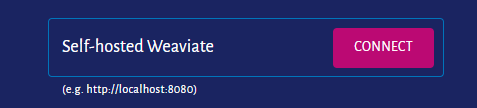

# Weaviate CI/CD pipeline

Deploy Weaviate server with CI/CD on Elestio

 
 

# Once deployed ...

You can can open Weaviate UI here:

    URL: https://[CI_CD_DOMAIN]
    email:root
    password: [ADMIN_PASSWORD]

# Weaviate Console

    https://console.weaviate.io/

You can login to the console with your self-posted address:

    https://[CI_CD_DOMAIN]

# Documentation

    https://weaviate.io/developers/weaviate/quickstart/installation
